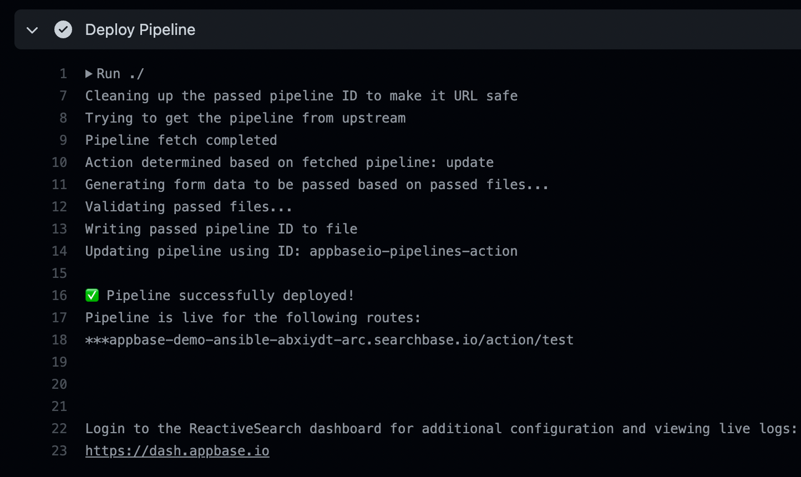

# About

GitHub Action to manage an Appbase.io pipeline from a github repository.



## Usage

This action can be used out of the box to manage a pipeline from a GitHub repository.

**[Get started with pipelines right away using our template repo](https://github.com/appbaseio/pipelines-template)**

Following is an example action.yaml for using the pipeline with default values and a `pipeline.yaml` file in the root of the repository:

```yaml
on: [push]

jobs:
  pipeline_deploy:
    runs-on: ubuntu-latest
    name: A job to deploy pipeline from the GitHub repo
    steps:
      - name: Deploy ReactiveSearch Pipeline
        uses: appbaseio/pipelines-action
        with:
          url: ${{secrets.APPBASEIOURL}}
```

## Inputs

It just requires a few inputs from the user:

| Field | Type | Required | Description | Default |
| --- | --- | --- | --- | --- |
| **`url`** | string | true | URL to connect to Appbase.io's instance | --- |
| **`pipeline_id`** | string | false | Pipeline ID to map for the pipeline | `<orgname>-<reponame>` |
| **`file`** | string | true | Path to the pipeline file | `./pipeline.yaml` |
| **`depends`** | string | false | This is a string of objects that are dependencies of the pipeline | '{}' |

## Development

The package is written in plain JS and the source code lies on the `src` directory. `src/index.js` is the main entrypoint into the action. However, since GitHub doesn't install the node modules, we are using [@vercel/ncc](https://github.com/vercel/ncc) to create a distributable `index.js` that contains all the code.

After making changes to the `src` directory, the `dist/index.js` file can be generated using the following:

```sh
ncc build src/index.js -o dist
```